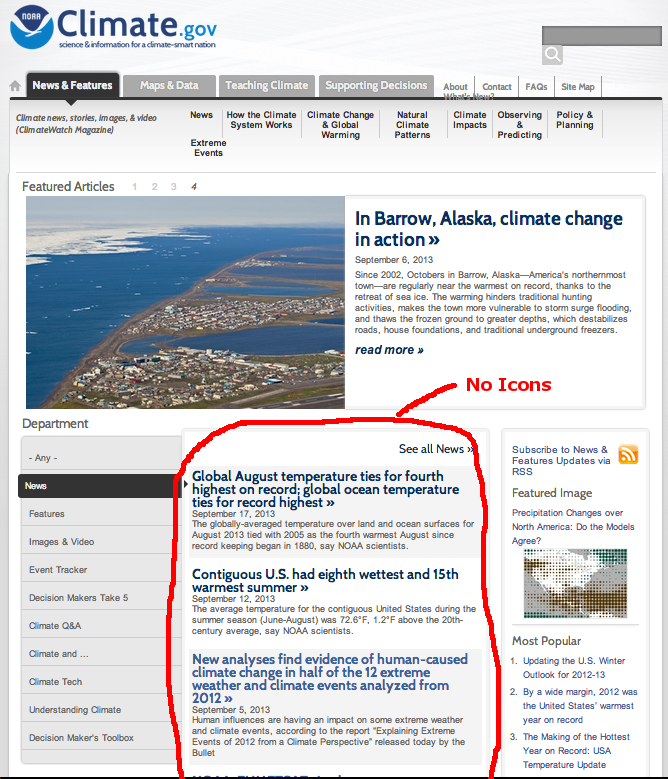
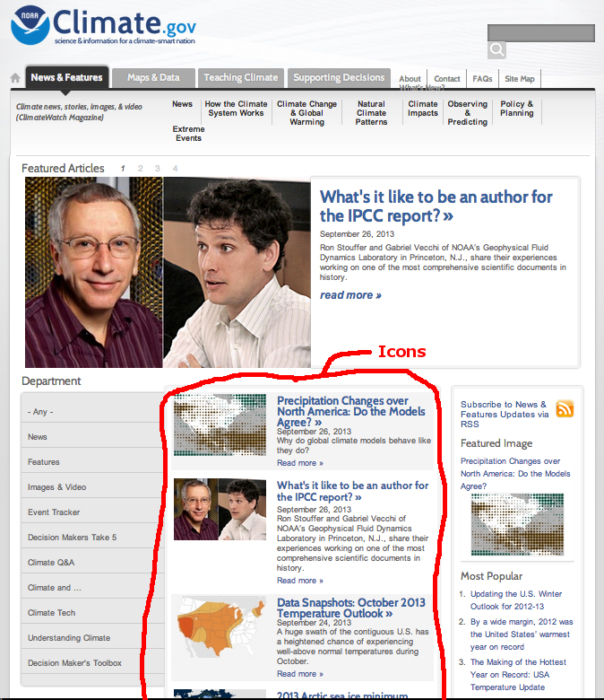

### News/Features Syndicated News Rotator Image

The files in this project document a procedure for adding a default
rotator image to the News/Features Syndicated News content type (machine-name
"news") on climate.gov.

This affects the way that syndicated news articles appear in the view
that shows the top 5 most recent new items.

More specfically, at present, syndicated news articles appear
in the top-5 items list in the bottom-middle part of the
News & Features page with no icon; see the red-circled area
in the image below for an example:



By contract, non-syndicated news items (i.e. articles that are hosted
on climate.gov itself) all have the potential to have rotator images,
which in turn results in Drupal creating a little icon to display
with each article's entry in the top-5 list.  See the red-circled
area in the image below for reference:



This git project document the steps that I have found for adding
a defaul rotator image to the "news" (News/Features Syndicated News) content
type, so that the default image will appear in the top-5 list.

This git project isn't a Drupal module or anything else that needs to
be installed -- it is simply a way of documenting what changes need to
be made to the site.


1. The first thing that needs to be done is to modify some CSS that is
   part of the site theme and which seems to interfere with the
   correct layout for "news" content items in teaser form when they
   have a rotator image. In particular, the following two rules in the file
   `sites/all/themes/custom/mu/css/mu-alpha-default.css` need to be
   commented out:

   ```css
   .view-nf-front-page-departments .node-news.view-mode-tiny_teaser .group-right {
       width:100%;
   }
   ```

   ```css
   .view-nf-front-page-departments .node-news.view-mode-tiny_teaser .group-left {
       width:0;
   }
   ```
   In order to be extremely explicit about these exact CSS changes, this project
   contains a copy of `mu-alpha-default.css`, first unchanged from the original,
   and then with these changes.  The commit containing the changes is 06b4e35,
   which you can view at the following URL:
   
       https://github.com/embeepea/nf-synd-rotator-image/commit/06b4e3578451d61b84ada21e0a4900d253464383

   I do not think that making these two changes has adverse affects on the site, but
   I have not done exhaustive testing.  It would be good to have several people preview
   multiple pages on a staged copy of the site after making these changes to confirm that
   there aren't any bad effects.
   
1. Choose a default image to be used.  The size allocated by the site theme for
   the rotator image icon is 155x103 pixels, so ideally, the default image should be 155x103.
   I don't know what image the site editor(s) will want to use, but for now you can use
   the file `NOAA-Transparent-Logo-155x103.png`, which is included in this project here:
   
   
   
   Note that if the logo used has a natural shape other than the full
   155x103 pixel rectangle (such as is the case for the NOAA logo,
   which is a circle), then it is a good idea for the image to have a
   transparent background, because the top-5 list uses zebra-striping
   with an alternating grey background, and a transparent image will
   correctly hide the real 155x103 rectangular shape of the image.

1. In the site's admin interface, upload the desired default image as the default
   value for the rotator image field for the "news" content type.
   
   Specifically:
   
   a. go to Structure -> Content Types -> News & Features Syndicated News
   
   a. click on the Manage Fields tab
   
   a. On the line for the "Rotator Image" field, click on the "edit" link
   
   a. in the "ROTATOR IMAGE FIELD SETTINGS" section at the bottom of the screen,
      upload the desired 155x103 image for the "Default Image".
      
      Important Note: there are two different "Default Image" fields on this
      screen.  One of them is higher up on the page, just after the list
      of "Enabled Browser Plugins".  Do not upload the image for that one.
      The one you want is the very last thing on the page, at the bottom,
      just above the "Save Settings" button.
      
   a. Click the "Save Settings" button
   
   
   
